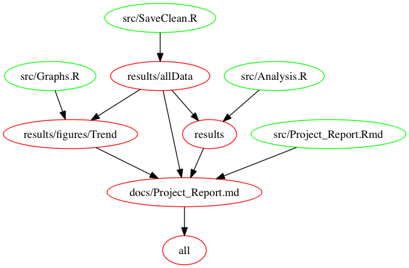

# Project: FX_Pass_Through

## Background and Theory

I will try to examine to see [the myth of EM FX pass-through](http://www.ashmoregroup.com/sites/default/files/article-docs/EV%20Mar%202017.pdf). Below you can see the definition of *FX pass through* from Ashmore's Article:

*One of the common perceptions about emerging markets (EMs) is that inflation rises sharply when currencies weaken, because weaker currencies push up domestic prices of imported goods and services. This phenomenon has a name: FX pass-through.*

The phenamenon is generally formulated with the following [regression formula](https://en.wikipedia.org/wiki/Exchange-rate_pass-through#cite_note-Campa_goldberg-2):

where

- p is import price,
- e is the exchange rate
- c is marginal costs
- d is demand
- Delta sign denotes the difference.

If you want an academic level analysis of the phenomenon. [Here](http://www.bankofcanada.ca/wp-content/uploads/2015/10/dp2015-91.pdf), you can find an interesting paper from Bank of Canada examines exchange rate pass-through due to the depreciation of Canadian Dollar against US Dollar in previous years.

## Data

I am planning to use monthly data from 2005 to 2017 on Turkish Lira against US Dollar (USDTRY) and Consumer Price Index.

Quandl enables us to reach these public data in CSV format.

- The Foreign Exchange Rate (USDTRY) data is from [Bank of England](https://www.quandl.com/api/v3/datasets/BOE/XUMLBK75.csv?api_key=tPKkRzbE46iPtm71hJM8&collapse=monthly) available on Quandle.

- The CPI inflation data is from [Central Bank of Turkish Republic](https://www.quandl.com/api/v3/datasets/CBRT/TP_FG_TG01.csv?api_key=tPKkRzbE46iPtm71hJM8&collapse=monthly) available on Quandle.

## Objectives

- Does FX rate depreciation have an effect on consumer prices?
- If there is an effect, what is the mean FxPassThrough value for the depreciation periods?

## Hypothesis

I believe FX rate depreciation has a positive effect on consumer prices for the depreciation periods. I will try to see what is the level for Turkey in the period between 2005 and 2017 when Turkish Lira depreciated against US Dollars.

## Analysis

I used tried linear regression model to see the association between foreign exchange pass through and consumer price inflation. I performed linear model in both for all periods and for only periods TRY has depreciated against USD.

## Scripts for Analysis

- `SaveClean.R` is the script for saving cpi and fx rate data from different sources. It binds them into one dataset and cleans it before making the analysis. It takes three arguments two of which is input files/address for cpi and fx_rate and the last one is output for combined clean data.

- `Analysis.R` is the script for analysis. It takes combined clean data from `SaveClean.R`. It produces the linear model results into a txt file as output.

- `Graphs.R` takes combined clean data from `SaveClean.R`. It produces two trend plots as output files. One plot is for all the periods, and the other one is specifically for depreciation periods.

- `Project_Report.Rmd` takes output plots and output linear model results from txt file which is produced by `Analysis.R`. It also presents the raw data.

## Running the Analysis

You need to be in the root directory of the project at your Terminal. Then, you need to run the following steps.

### Makefile:

From your terminal, run `make all` at root directory to make the previous steps at once. The makefile can be used by changing the input data for different analyses.

If `make all` does not work, you may need to use `make clean` to clean the files first. Then, `make all` will create the files again for you.

#### Makefile dependency structure

You can see the dependency structure the makefile has, and which files are runned. 

## Package Dependencies

It is an R language project. You will need to have the following packages.

- Tidyverse (it is actually a package universe)
- Ezknit

## Dockerfile

Docker image for the project can be found at [https://hub.docker.com/r/cemsinan/fx_pass_through/ ](https://hub.docker.com/r/cemsinan/fx_pass_through/).

If you can to run the project from a Docker container. You can pull the project with following command:

`docker pull cemsinan/fx_pass_through`
 
## Author

This repository is created by Cem Sinan Ozturk on 2017-11-23.
