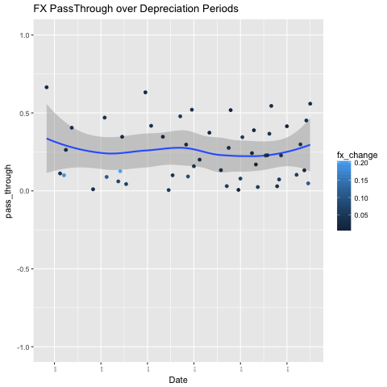

## Background and Theory

I will try to examine to see [the myth of EM FX pass-through](http://www.ashmoregroup.com/sites/default/files/article-docs/EV%20Mar%202017.pdf). Below you can see the definition of *FX pass through* from Ashmore's Article:

*One of the common perceptions about emerging markets (EMs) is that inflation rises sharply when currencies weaken, because weaker currencies push up domestic prices of imported goods and services. This phenomenon has a name: FX pass-through.*

The phenamenon is generally formulated with the following [regression formula](https://en.wikipedia.org/wiki/Exchange-rate_pass-through#cite_note-Campa_goldberg-2): 

$$ \Delta \ln p_{t} = \alpha + \sum_{i=0}^{N} \gamma_{i}\Delta e_{t-1} + \delta\Delta \ln c_{t} + \psi \Delta \ln d_{t} + \epsilon_{t} $$


where

- p is import price, 
- e is the exchange rate 
- c is marginal costs 
- d is demand
- $\Delta$ sign denotes the difference.

If you want an academic level analysis of the phenomenon. [Here](http://www.bankofcanada.ca/wp-content/uploads/2015/10/dp2015-91.pdf), you can find an interesting paper from Bank of Canada examines exchange rate pass-through due to the depreciation of Canadian Dollar against US Dollar in previous years.

## Data

I use monthly data from 2005 to 2017 on Turkish Lira against US Dollar (USDTRY) and Consumer Price Index. 

Quandl enables us to reach these public data in CSV format.

- The Foreign Exchange Rate (USDTRY) data is from [Bank of England](https://www.quandl.com/api/v3/datasets/BOE/XUMLBK75.csv?api_key=tPKkRzbE46iPtm71hJM8&collapse=monthly) available on Quandle.


```r
head(fx_rate)
```

```
## # A tibble: 6 x 2
##         Date  Value
##       <date>  <dbl>
## 1 2017-11-30 3.9050
## 2 2017-10-31 3.7979
## 3 2017-09-30 3.5563
## 4 2017-08-31 3.4528
## 5 2017-07-31 3.5237
## 6 2017-06-30 3.5210
```

- The CPI inflation data is from [Central Bank of Turkish Republic](https://www.quandl.com/api/v3/datasets/CBRT/TP_FG_TG01.csv?api_key=tPKkRzbE46iPtm71hJM8&collapse=monthly) available on Quandle.


```r
head(cpi_index)
```

```
## # A tibble: 6 x 2
##         Date  Value
##       <date>  <dbl>
## 1 2016-12-31 292.54
## 2 2016-11-30 287.81
## 3 2016-10-31 286.33
## 4 2016-09-30 282.27
## 5 2016-08-31 281.76
## 6 2016-07-31 282.58
```

After I get the data for both Foreign Exchange Rate and Consumer Price Index, I bind them into one dataset to be able to play with it.

My ultimate aim is to make to have an analysis structure works with any data in the specified structure.

## Objectives

- Does FX rate depreciation have an effect on consumer prices?
- If there is an effect, what is the mean FxPassThrough value for the depreciation periods?

## Hypothesis

I believe FX rate depreciation has a positive effect on consumer prices for the depreciation periods. I will try to see what is the level for Turkey in the period between 2005 and 2017 when Turkish Lira depreciated against US Dollars. 


## Exhange Rate Pass-through in Turkey over time(2005-2017):


I will use the model below which is also used in [Pimco's report](https://www.pimco.com/handlers/displaydocument.ashx?wd=Insight&id=IPTTwLZx6SCF6y4wkZDwSakLUrqhdMLIng4oyN6u0%2BzYm7UoXwKqIMiTO%2B5oXQGLO%2Fji9Ek8ekAiYIt96KRO8BM%2BltZKiu0Pgson5daY6DegSCAIFA3S4VEva2MnNz7G7vE7VcHA0h2rvKbRUhbvMzHkxSO%2B7t4MbO8FuzC6KXxVS7ZEBQjo5TYmzq6pRDIu4qB46eThoKubIj%2BQcAPHDlMQZFuspjbVnVXm6X5ROXVJV80pf7phrKzNkxomPas7c5DHakNe7RqGlSPOjRIttm%2B%2F%2FObvbCQrbCdAU%2BUfDysrgGJucp7tQ5xnsmA0twO52ToZDTppx9AVI8xYu%2FfGBQ%3D%3D):

$cpi_{t} = \beta_0 + \beta_{1}* FXrate_{t-1} + \beta_{2}* FXrate_{t} + \beta_{3}* FXrate_{t-1}+\epsilon$ 

which is the first model in the below.


```
## [1] ""
## [1] "Call:"
## [1] "lm(formula = cpi ~ lag(cpi) + fx_change + lag(fx_change), data = all_data)"
## [1] ""
## [1] "Residuals:"
## [1] "      Min        1Q    Median        3Q       Max "
## [1] "-0.024173 -0.004918 -0.001419  0.005480  0.025625 "
## [1] ""
## [1] "Coefficients:"
## [1] "                Estimate Std. Error t value Pr(>|t|)    "
## [1] "(Intercept)    0.0055270  0.0008763   6.307 3.77e-09 ***"
## [1] "lag(cpi)       0.1439081  0.0853558   1.686   0.0941 .  "
## [1] "fx_change      0.0115855  0.0164674   0.704   0.4829    "
## [1] "lag(fx_change) 0.0132264  0.0164795   0.803   0.4236    "
## [1] "---"
## [1] "Signif. codes:  0 ‘***’ 0.001 ‘**’ 0.01 ‘*’ 0.05 ‘.’ 0.1 ‘ ’ 1"
## [1] ""
## [1] "Residual standard error: 0.007761 on 135 degrees of freedom"
## [1] "  (1 observation deleted due to missingness)"
## [1] "Multiple R-squared:  0.03135,\tAdjusted R-squared:  0.009822 "
## [1] "F-statistic: 1.456 on 3 and 135 DF,  p-value: 0.2294"
## [1] ""
## [1] ""
## [1] "Call:"
## [1] "lm(formula = cpi ~ lag(cpi) + fx_change, data = deflation_data)"
## [1] ""
## [1] "Residuals:"
## [1] "      Min        1Q    Median        3Q       Max "
## [1] "-0.009664 -0.005367 -0.001947  0.004435  0.016125 "
## [1] ""
## [1] "Coefficients:"
## [1] "             Estimate Std. Error t value Pr(>|t|)    "
## [1] "(Intercept)  0.007869   0.001724   4.564 2.86e-05 ***"
## [1] "lag(cpi)    -0.106240   0.131530  -0.808   0.4227    "
## [1] "fx_change    0.046748   0.022519   2.076   0.0426 *  "
## [1] "---"
## [1] "Signif. codes:  0 ‘***’ 0.001 ‘**’ 0.01 ‘*’ 0.05 ‘.’ 0.1 ‘ ’ 1"
## [1] ""
## [1] "Residual standard error: 0.00657 on 55 degrees of freedom"
## [1] "  (1 observation deleted due to missingness)"
## [1] "Multiple R-squared:  0.0925,\tAdjusted R-squared:  0.0595 "
## [1] "F-statistic: 2.803 on 2 and 55 DF,  p-value: 0.06931"
## [1] ""
```

The regression result on general data shows us the change in exchange rate in both `t-1` and `t` do not have significant affect on consumer price inflation. In this data, we cannot find enough evidence to believe any relationship between exchange rate and consumer price index. 

However, our hypothesis is if the exchange rate shocks does any affect on the consumer price index. Therefore we should use the following regression for the periods where `fx_change` is bigger than zero which means where Turkish Lira depreciated agaings US Dollars.

$cpi_{t} = \beta_0 + \beta_{1}*  + \beta_{2}* fxchange_{t} +\epsilon$ 

$fxchange = \frac{FXrate_{t}}{FXrate_{t-1}}-1$ 

Here, you can see the trend for depreciation periods:



This graph confirms the 0.046 at linear model result for `fx_change` onto `cpi`. We can say `pass_through` will be around 0.5 for depreciation period which makes sense as we define pass_through as `cpi/fx_change`.  
 
This is the second linear model results above, and it gives significant result for FX change. It means we have enough evidence to believe FX losses has affect on the local currency TRY depreciate against a major currency such as USD. 

It is a very primitive analysis to see the affect of foreign exchange losses on a developing countries consumer price index. But, luckily we have significant result to encourage us for further analyses.

## Future Analyses

For the future analysis, it can be better to examine the inflation spread with US would be better variable since we can elaminate the US inflation affect on exchange rate. 

Another assignment would be to use more complicated model like the one shown in the introduction.
